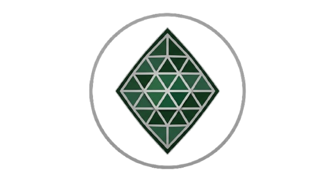
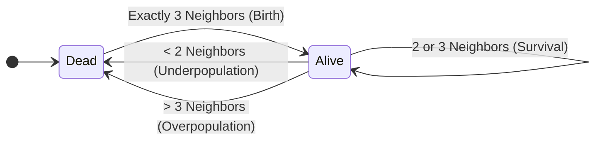
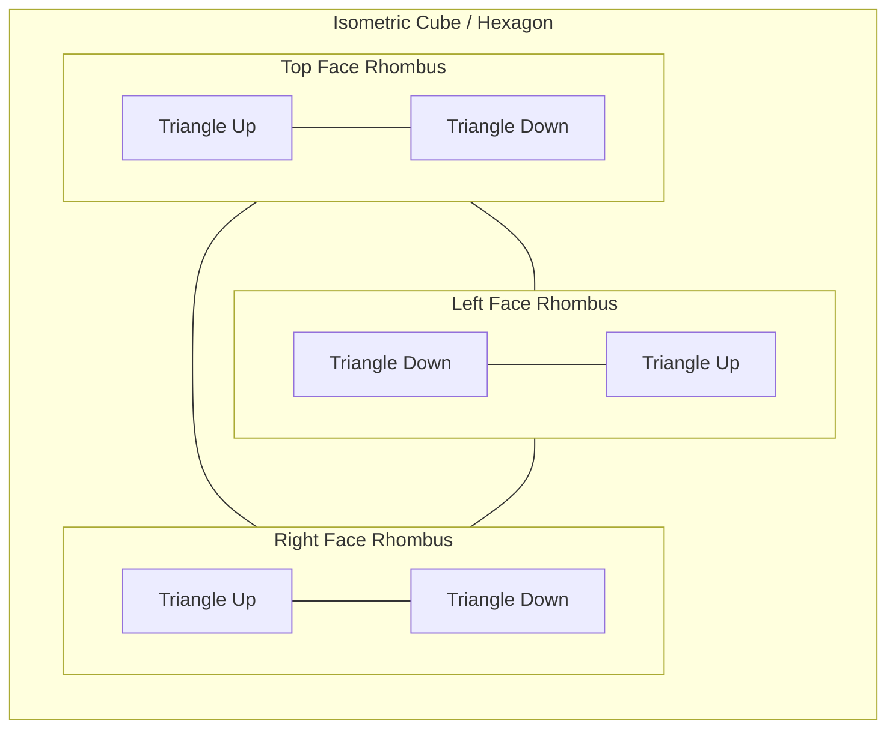

**Trilife** is a cellular automaton that applies the classic rules of Conway's Game of Life to a triangular grid. By manipulating coordinates, triangular grid cells map together to form rhombuses, which visually combine to represent 3D cubes in an isometric perspective.

## The Rules of the Game

Trilife adapts the famous 1970 cellular automaton rules designed by British mathematician John Horton Conway. Instead of evaluating 8 adjacent squares, Trilife evaluates the state of 12 nearby triangular neighbors. Despite the different and larger neighborhood layout, Trilife rigorously sticks to Conway's exact numeric life-and-death constants.



For every tick in the simulation:
- **Birth**: A dead triangle with exactly 3 living neighbors becomes alive.
- **Survival**: A living triangle with 2 or 3 living neighbors remains alive.
- **Death**: In all other cases (`< 2` or `> 3`), the cell dies or remains dead because of loneliness or overcrowding.

## Geometry and Coordinate System

Mapping a 2D coordinate space onto a hexagonal or cubic plane requires a specific geometric approach. In Trilife, the grid is composed of discrete triangles oriented either "up" or "down".

These triangles connect to form larger structures:
- **1 Rhombus** = 2 adjacent triangles (one Up, one Down).
- **1 Isometric Cube (Hexagon)** = 3 adjacent rhombuses = 6 triangles intersecting at a shared center vertex.



The rendering engine processes the 2D plane using a column (`c`) and row (`r`) schema. Depending on whether `(c + r) % 2 === 0`, a triangle will either point Upwards or Downwards, which subsequently determines which flattened 12-neighbor coordinate offset array is used to compute its next generation.

## Running the Application

This is a modern React front-end created with Vite.

**Development Server:**
```bash
npm install
npm run dev
```

**Production Build:**
```bash
npm run build
npm run preview
```
